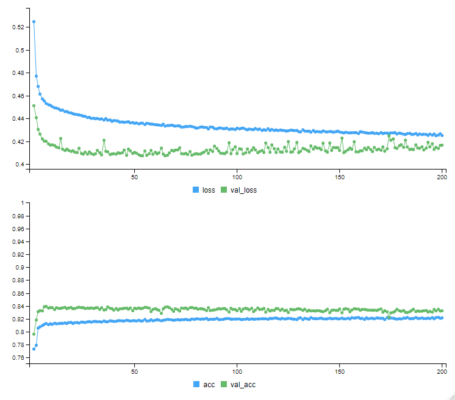

# Prediction of default payment of credit card

This is a binary classification task of predicting whether the Credit card holder will pay the current default. A small fully-connected neural network is developed in R and used for binary classification.

## Data

The data is taken from [UCI Machine Learning Repository](https://archive.ics.uci.edu/ml/datasets/default+of+credit+card+clients). 

The data has 30000 samples and 25 attributes (including labels). The attributes are as follows.

Column | Content |
--- | --- |
X1 | ID |
X2 | Total Credit Limit |
X3 | Gender |
X4 | Education Level |
X5 | Marital Status |
X6 | Age |
X7-12 | Payments of past 6 months, scaled from -1 to 9 |
X13-18 | Bill amount of past 6 months |
X19-24 | Payment amount of past 6 months |
X25 | Default payment |

For more information about the data, refer [this paper](https://bradzzz.gitbooks.io/ga-seattle-dsi/dsi/dsi_05_classification_databases/2.1-lesson/assets/datasets/DefaultCreditCardClients_yeh_2009.pdf).

## Requirements

R (3.5.3)

keras (2.2.4)*

caret (6.0)

DataExplorer (0.8.0)

readxl (1.3.1)

Above requirements are my tested environment. Exact versions may not be necessary for the successful execution of the code. Dependency packages of the above requirements are not listed here.
*This Keras use Python TensorFlow (1.13.2) as backend installed in Anaconda Environment.

## Data Pre-processing

The data from *csv* file is imported and it is as below.

The first row of the data is column names. Hence, it is removed and assigned as column names.

The ID column is not necessary. So, it is assigned as row names.

Even though the current data has only numbers in it, these are present as nominal values (strings). So, each column is made numeric.

There are no missing values in this dataset.

All the remaining column are normalized using min-max normalization. Per column, the lowest value is assigned 0, the highest value is assigned 1, and the remaining values are distributed between 0 and 1.

The value frequency of each column, after normalization, is as follows.

The target variables are highly unbalanced, with label 0 being 23364 and label 1 being 6636.

The training and testing datasets are divided in 3:1 ratio. This data split is done according to the labels and the same label distribution is maintained in both datasets. The metrics of this data split are summarized in the table below.

Data | 0s | 1s | Total |
--- | --- | --- | --- |
Train data | 17522 | 4978 | 22500 |
Test data | 5842 | 1658 | 7500 |

## Neural Network

A five-layer dense neural network is developed. The layout of this network is summarized below.

The output layer has *softmax* activation, while the remaining layers use *relu* as the activation function. Since, this is a binary classification task, *binary_crossentropy* is used as the loss function. *Adam* optimizer is used with a learning rate of 0.001.

32 is a popular batch-size to choose. But here, 32 batch doesn't divide the train data perfectly. So, a batch-size of 36 is chosen. For the initial process, the train data is further split to get a 25% validation data. Keras takes samples for validation data from the end of train data. Then, the network is trained for 200 epochs. The training process is shown below.

The validation loss is observed to increase after 100 epochs. So, it is good to stop the training process at 100 epochs. Since, the data is small, it is necessary to feed the network with full train data. So, the second split for validation data is removed and the network is freshly trained on full training data.

After that, the network is evaluated on the test dataset. The evaluation metrics are shown in the form of confusion-matrix below.

<i></i> | 0 | 1 | Accuracy |
--- | --- | --- | --- |
0 | 5496 | 1018 | 84.37% |
1 | 346 | 640 | 64.9% |
<i></i> | <i></i> | <i></i> | 81.81% |

Label 0 is predicted with an accuracy of 84.37%, while label 1 is predicted with an accuracy of 64.9%. Label 1 has low accuracy because of its low number of samples in train data. With this, the overall accuracy of this model is 81.81%.

## To-do

1. Upsampling of data. Especially for label 1.
2. Tuning of neural network layout.
3. Experimenting with simpler algorithms, like SVM. 